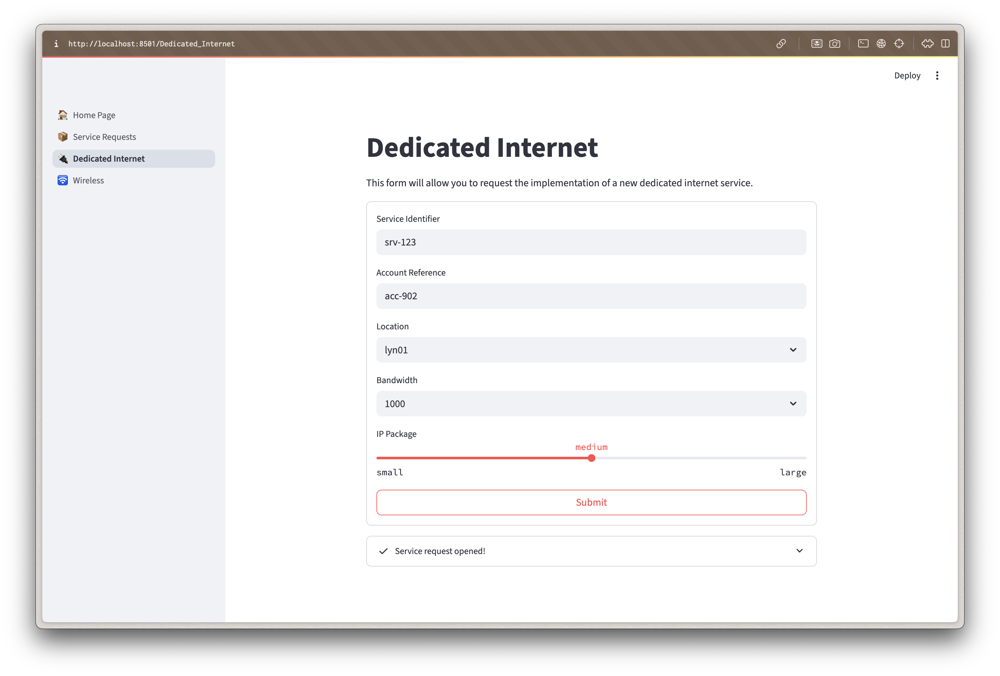
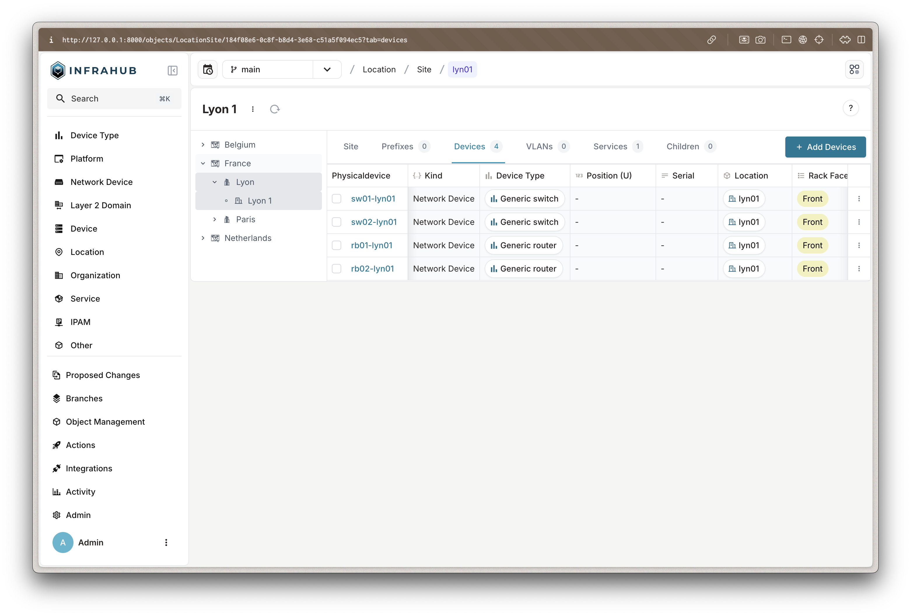
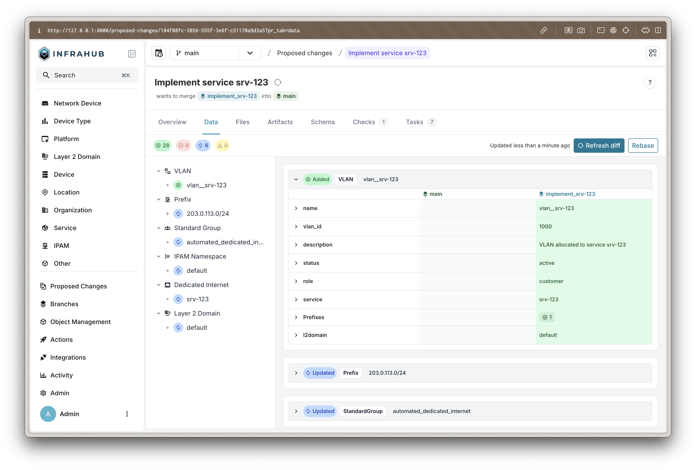

import ReferenceLink from "../src/components/Card";

This walkthrough will guide you through the steps to run the demo from a user perspective. It assumes you have already set up the environment as described in the [installation guide](installation).

If you want more information about the business case and how this PoC was built, you can read the corresponding [blog post](https://opsmill.com/blog/how-to-turn-your-source-of-truth-into-a-service-factory/) on the OpsMill website.

<ReferenceLink title="Turn your source of truth into a service catalog" url="https://opsmill.com/blog/how-to-turn-your-source-of-truth-into-a-service-factory/" openInNewTab/>

## 🧑‍🔧 Service delivery engineer

The goal as a service delivery engineer is to request new services for customers and follow the ongoing implementations.

### Open a new service request

- You can access the service catalog at `http://localhost:8501`.
- Then, navigate to "Dedicated Internet" using the sidebar.
- Fill out the form to request a new dedicated internet service.
- Submit the request.

:::success

Your request will be submitted to Infrahub, where it will be processed by a network architect.

:::

### List ongoing requests

- Navigate to "Service Requests" using the sidebar.
- You will see a list of all your requests, including the one you just submitted.
- You might come back to that page later to check the fully implemented service.

:::success

When the request is approved, you will be able to see the details of the service and its components.

:::

## 🧑‍💻 Network architect

The goal as a network architect is to carry out day-to-day operations and implement the requested services.

### View current state of the network

- You can access Infrahub at `http://localhost:8000`.
- Log in with the username `admin` and password `infrahub`.
- On the left sidebar, there are several objects that represent the current state of the network.
- Click `Location` > `Site` to see the list of sites.
- Click on a site to view its details, including the assigned components like VLANs and devices.

:::success

Infrahub can store all the data related to the network, including sites, devices, VLANs, and more, allowing teams to have a centralized view of the network's intended state.

:::

### Review and approve service requests

- Navigate to `Proposed Changes` in the left sidebar.
- You should see an entry for the service request you submitted as a service delivery engineer.
- Click on the entry to view the details of the proposed changes.
- Click the `Checks` tab to review the checks that have been run on the proposed changes (the generator one should be successful).
- Click the `Data` tab; you should see the service data entered earlier.
- Click the `Refresh Diff` button.
- You should now see the full-blown service, including components like VLANs and gateways assigned by the generator.
- Moving back to the `Overview` tab, you can click the `Merge` button to approve the changes.

:::success

As a network architect, the only thing you need to do is review the proposed changes and approve them. Infrahub takes care of allocating the resources and implementing the service exactly as you've defined it in the generator.

:::
