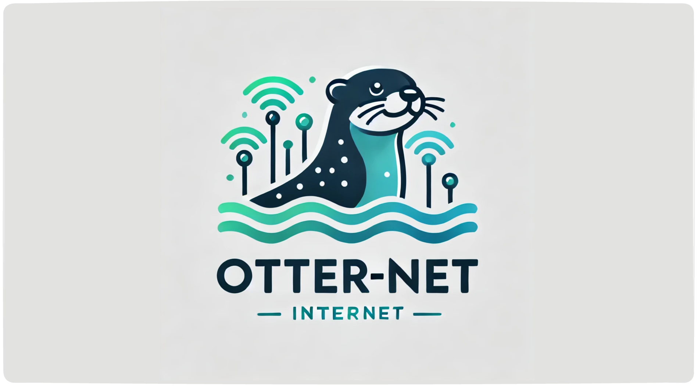
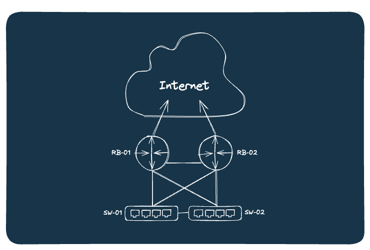
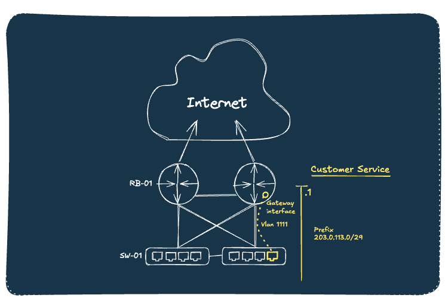

import ReferenceLink from "../src/components/Card";
import VideoPlayer from '../src/components/VideoPlayer';

## Infrahub - PoC of a service catalog

This repository demonstrates a proof of concept for a service catalog using Infrahub and Streamlit.

  <VideoPlayer url='https://youtu.be/FbM9XA38wDk?si=8_lGl5zefZy9v7AM' light />

For more information about the business case and the development of this PoC, read the [blog post](https://opsmill.com/blog/how-to-turn-your-source-of-truth-into-a-service-factory/) on the OpsMill website.

<ReferenceLink title="Blog post" url="https://opsmill.com/blog/how-to-turn-your-source-of-truth-into-a-service-factory/" openInNewTab/>

## Getting started

To get started quickly, follow these steps:
- Go through the [installation](getting-started/installation) guide.
- Run the demo by following the [user walkthrough](getting-started/user-walkthrough).
- To understand the implementation details, see the [developer walkthrough](getting-started/developer-walkthrough).

## The problem

Organizations strive to deliver services efficiently, as this is where value is created.

The stakes are high: the structure of a service determines everything downstream—from invoicing and lifecycle management to resource allocation and capacity planning. A poorly designed service layer can lead to inefficiencies and challenges at every stage.

The service catalog forms the foundation of this structure, serving as a blueprint for how services are defined, managed, and delivered. It enables infrastructure self-service across the organization to streamline operations and enhance service delivery.

## Use case

This demo follows a fictional ISP, Otter-net, which provides standard internet connectivity.

The company operates multiple points of presence across Europe. Currently, it offers a single service: dedicated internet access. This service provides customers with a physical port and a set of public IP addresses for hosting services. Additional services are planned for the future!

The operational team at Otter-net is divided into two groups:

- Network Architects: Experts with extensive networking experience, responsible for operating and maintaining the backbone network.
- Service Delivery Team: Customer-facing professionals responsible for provisioning and connecting services to the backbone.

:::success[The goal]

The goal of the company is to automate the service delivery process, allowing the service delivery team to request new services without needing to involve network architects for every request. This will enable faster and more efficient service delivery.

:::

## The solution

Implementing a service catalog is a complex operation that many organizations struggle with. It demands a deep understanding of the product lifecycle, the interplay of various components, and coordination among numerous stakeholders. Beyond that, it requires a robust technical implementation to automate all the associated rules and processes properly.

In many ways, Infrahub is the perfect tool to support your service catalog implementation:
- **Flexible Schema**: Infrahub's schema can be tailored to fit the specific needs of your service catalog, allowing you to define services, components, and their relationships in a way that makes sense for your organization.
- **Version Control**: Infrahub's native version control capabilities enable you to track changes, ensuring that you have full visibility into the evolution of your network.
- **Generators**: Infrahub's generators can be used to codify the rules and processes associated with your service implementation, enabling fast and consistent implementation across the board.
- **Resource Managers**: Infrahub's resource managers can be used to automate the allocation and management of resources, ensuring robust and efficient resource management.
- **Branching**: Infrahub's branching capabilities allow you to isolate changes in a separate branch, paving the way for testing and validation before deploying changes to production.

If you want more information about the business case and how this PoC was built, you can read the corresponding [blog post](https://opsmill.com/blog/how-to-turn-your-source-of-truth-into-a-service-factory/) on the OpsMill website.

<ReferenceLink title="Blog post" url="https://opsmill.com/blog/how-to-turn-your-source-of-truth-into-a-service-factory/" openInNewTab/>
